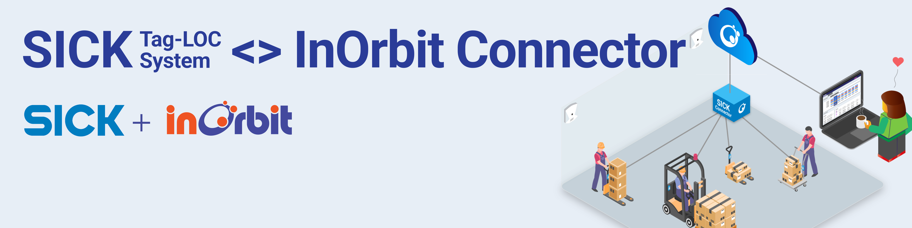

# SICK Tag LOC InOrbit Connector



<table align="center">
  <thead>
    <tr>
      <th>OS</th>
      <th>Python 3.10</th>
      <th>Python 3.11</th>
      <th>Python 3.12</th>
    </tr>
  </thead>
  <tbody>
    <tr>
      <td>Linux</td>
      <td><a href="https://inorbit.teamcity.com/buildConfiguration/Engineering_Development_DeveloperPortal_Connectors_SickTagLocConnector_LinuxPython310QualityCheck?branch=%3Cdefault%3E&mode=builds"></td>
      <td><a href="https://inorbit.teamcity.com/buildConfiguration/Engineering_Development_DeveloperPortal_Connectors_SickTagLocConnector_LinuxPython311QualityCheck?branch=%3Cdefault%3E&mode=builds"></td>
      <td><a href="https://inorbit.teamcity.com/buildConfiguration/Engineering_Development_DeveloperPortal_Connectors_SickTagLocConnector_LinuxPython312QualityCheck?branch=%3Cdefault%3E&mode=builds"></td>
    </tr>
    <tr>
      <td>MacOS</td>
      <td><a href="https://inorbit.teamcity.com/buildConfiguration/Engineering_Development_DeveloperPortal_Connectors_SickTagLocConnector_MacPython310QualityCheck?branch=%3Cdefault%3E&mode=builds"></td>
      <td><a href="https://inorbit.teamcity.com/buildConfiguration/Engineering_Development_DeveloperPortal_Connectors_SickTagLocConnector_MacPython311QualityCheck?branch=%3Cdefault%3E&mode=builds"></td>
      <td><a href="https://inorbit.teamcity.com/buildConfiguration/Engineering_Development_DeveloperPortal_Connectors_SickTagLocConnector_MacPython312QualityCheck?branch=%3Cdefault%3E&mode=builds"></td>
    </tr>
    <tr>
      <td>Windows</td>
      <td><a href="https://inorbit.teamcity.com/buildConfiguration/Engineering_Development_DeveloperPortal_Connectors_SickTagLocConnector_WindowsPython310QualityCheck?branch=%3Cdefault%3E&mode=builds"></td>
      <td><a href="https://inorbit.teamcity.com/buildConfiguration/Engineering_Development_DeveloperPortal_Connectors_SickTagLocConnector_WindowsPython311QualityCheck?branch=%3Cdefault%3E&mode=builds"></td>
      <td><a href="https://inorbit.teamcity.com/buildConfiguration/Engineering_Development_DeveloperPortal_Connectors_SickTagLocConnector_WindowsPython312QualityCheck?branch=%3Cdefault%3E&mode=builds"></td>
    </tr>
    <tr>
      <td><a href="https://www.jetbrains.com/qodana/">Qodana</a></td>
      <td colspan=3 align="center"><a href="https://inorbit.teamcity.com/buildConfiguration/Engineering_Development_DeveloperPortal_Connectors_SickTagLocConnector_QodanaLinuxQualityCheck?branch=%3Cdefault%3E&mode=builds"></td>
    </tr>
  </tbody>
</table>

## Overview

A Python connector for [SICK](https://www.sick.com/us/en/) Tag-LOC into [InOrbit](https://inorbit.ai/). Built on top of the [inorbit-connector-python](https://github.com/inorbit-ai/inorbit-connector-python) package, it provides a way to integrate the SICK's Tag-LOC system with InOrbit for real time location tracking.

## Features

Running one instance of the Connector per SICK Tag-LOC system unlocks the following key features:
- Real-time location tracking of multiple SICK Tags.
- Integration with InOrbit's heterogeneous fleet and traffic management features.
- Customizable configurations footprints for tracked tags.
- All of the features provided by the InOrbit platform.

## Requirements

- Python 3.10 or later.
- InOrbit account [(it's free to sign up!)](https://control.inorbit.ai)
- SICK Tag-LOC system.

## Setup

<!-- TODO: Install from PyPi instructions

There are two ways for installing the connector Python package.

1. From PyPi: `pip install inorbit-instock-connector`

2. From source: clone the repository and install the dependencies: -->

### Installation from source

Clone the repository and install the dependencies:

```bash
virtualenv .venv
. .venv/bin/activate
pip install -e .
```

### Configure the Connector

- Copy [`config/example.yaml`](config/example.yaml) and modify the settings to match your setup. Each configurable parameter is documented in the file itself.

- Copy [`config/example.env`](config/example.env) to `config/.env` and set the environment variables following the instructions in the same
  file. You can get the `INORBIT_API_KEY` for your account from InOrbit's
  [Developer Console](https://developer.inorbit.ai/docs#configuring-environment-variables).

## Deployment

### Run the Connector manually

Once all dependencies are installed and the configuration is complete, the Connector can be run with the `sick-tag-loc-connector` command (run with `--help` for details).

```bash
# Add the environment variables, activate the virtual environment and run the Connector
export $(grep -v '^#' config/.env | xargs) && \
source .venv/bin/activate && \
sick-tag-loc-connector -c config/example.yaml
```

A [script](scripts/start.sh) was provided to help run the Connector.

```
❯ ./scripts/start.sh
Usage: ./scripts/start.sh <config_basename> [<args>]
Example: `./scripts/start.sh local -v` runs the Connector with the 'config/local.yaml' configuration and the flag '-v'

  The script will start the InOrbit SICK Tag-LOC RTLS Connector with the specified YAML configuration from the config directory. Extra arguments will be passed to the Connector.
  The Connector will be run in a virtual environment located in the '/home/tomas/InOrbit/sick-tag-loc-connector/.venv' directory.
  If '/home/tomas/InOrbit/sick-tag-loc-connector/config/.env' exists, its variables will be exported. It is a good place to set environment variables like `INORBIT_API_KEY`.
  Available configurations:
example
```

### Run the Connector as a service

To run the Connector as a service, you can use the provided systemd service file. It can be installed by running [`scripts/install_service.sh`](scripts/install_service.sh).

Example: create a service named `sick-tag-loc-connector@my_config.service` that runs the Connector with the `config/my_config.yaml` configuration.

```bash
./scripts/install_service.sh my_config
```

The service can be enabled at boot and started with

```bash
sudo systemctl enable sick-tag-loc-connector@my_config.service
sudo systemctl start sick-tag-loc-connector@my_config.service
```

Run `./scripts/install_service.sh` with no arguments for more information.

## Next Steps

<!-- TODO -->


